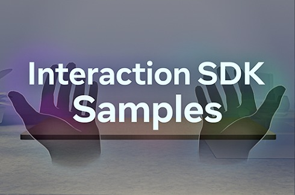

# Unity-InteractionSDK-Samples


External samples for the Interaction SDK (ISDK) featuring advanced implementations and integrations beyond core package samples.

## 📦 Developer Workflows

### 🚀 Flow 1: Unity-Linked GitHub Samples
**For users who want specific samples matching their ISDK version**

1. **Install ISDK** in your Unity project via Package Manager
2. In Unity Editor:
   - Open **Window → Package Manager**
   - Select **ISDK** from packages list
   - Go to **Samples** tab
   - Click **"GitHub Samples"** link (opens this repository)
3. **On GitHub Repository**:
   - Click the **"Releases"** tab (right navigation bar)
   - Find release matching your ISDK version (e.g. `v74`)
4. **In Selected Release**:
   - Verify version compatibility in release notes
   - Under **Assets** section, download needed `.unitypackage` files
5. **Import Samples**:
   - Double-click downloaded packages
   - Confirm import in Unity Editor

⚠️ **Critical**: Samples require **ISDK version match** (v74 samples → v74 ISDK)


### 🔧 Flow 2: Full Repository Clone
**For users wanting all samples**

1. Clone this repo using either the green "**Code**" button above or this command in the terminal.
    ```sh
    git clone https://github.com/oculus-samples/Unity-InteractionSDK-Samples.git
    ```
2. **Open Project** in Unity Hub:
   - Select cloned repository folder
   - Use Unity version **Unity 2022.3 LTS or above**.
3. **Access Samples**:
   - Navigate to `Assets/ShowcaseSamples/`
   - Open sample scenes directly

## Licenses

The [OCULUS SDK LICENSE](./LICENSE.txt) applies to the majority of the project, however files from [Text Mesh Pro](https://unity.com/legal/licenses/unity-companion-license) are licensed under their respective licensing terms.
